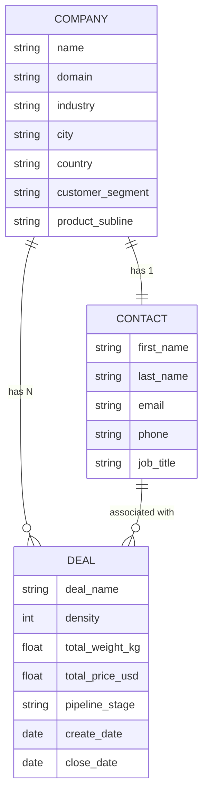

# Espumas Cotopaxi: HubSpot CRM Case Study (Sales Ops / RevOps Portfolio Project)

> ⚠️ **All data in this project (Companies, Contacts, Deals, sales figures) is 100% fictional**, synthetically generated with Python. "Espumas Cotopaxi" is not a real company. This project was built to demonstrate Sales Ops / Revenue Ops skills in HubSpot CRM, not to report data from an existing business.

*[Versión en español disponible en `README.md`]*

---

## 1. TL;DR

- **Simulated business:** fictional B2B industrial polyurethane foam factory, with a sell-by-sheet pricing logic (not by direct weight).
- **Dataset:** 49 Companies, 49 Contacts, 125 Deals, generated in Python with verifiable business rules (customer segmentation by purchase weight, density → price/kg, 4 product sub-lines, 4 sales zones).
- **CRM:** HubSpot (account with a Sales Hub Enterprise trial, details in section 3).
- **Deliverables:** 11 reports in a HubSpot Dashboard plus 1 Workflow with conditional logic (trigger, delay, if/then branch, task creation), tested and documented.
- **9+ real import and configuration errors** found, diagnosed, and fixed, documented with root cause, not just the fix.
- **Stack:** Python (pandas) for data generation and all business calculations, HubSpot CRM for object modeling, pipeline, reporting, and automation.
- **Methodology:** built with Claude (Anthropic) as a copilot for code generation and documentation, under the author's direction and verification for every business decision, every analysis, and every correction.

---

## 2. The problem

After 4 years as a Quality Lab Engineer and 3 years as Sales Lead for the Foams line at an industrial manufacturer (Chaide, Ecuador), I had real B2B business judgment: pricing, customer segmentation, industrial sales cycles. What I didn't have was demonstrable CRM experience.

With no access to a company HubSpot to practice on, I built the entire ecosystem from scratch: a simulated business with real pricing logic, a synthetic dataset in Python, and a full HubSpot implementation (objects, properties, pipeline, dashboard, automation). The goal: an auditable case study that shows both sides, that I understand the business behind the CRM and that I know how to build it.

---

## 3. Data disclaimer and technical stack

- **Data:** Companies, Contacts, and Deals are 100% synthetic, generated with `scripts/generar_dataset_cotopaxi_v5.py`. No name, figure, or email corresponds to a real entity.
- **HubSpot, account plan:** the account has an active trial of all 6 Hubs at Enterprise tier (activated 07/14/2026, 90 days, estimated expiration ≈ 10/12/2026), verified in Settings → Account & Billing → Products & Add-ons.
- **Technical stack:** Python 3 and pandas for dataset generation and for solving all conversion logic (Volume → Weight → Price, sales cycle length, zone denormalization). HubSpot doesn't calculate anything automatically: "custom equation" properties are a paid-plan feature (Sales Enterprise) and were not used.
- **Working methodology:** this project was built using a Claude (Anthropic) Project as a continuous workspace throughout the whole cycle: defining the simulated business, generating the dataset in Python, and writing this documentation. The business logic (formulas, segmentation, density rules), the data model, the full HubSpot implementation, the dashboard analysis, and the mathematical validation of every dataset version were defined and carried out by the author. Claude assisted with code generation and with drafting this documentation, under direct guidance.

---

## 4. Simulated business context

**Espumas Cotopaxi**, a fictional B2B industrial polyurethane foam factory, selling directly to manufacturers and workshops (not to end consumers).

### Sales logic: Sheet → Weight → Price

Foam is sold in **sheets** (fixed 100 cm × 200 cm, variable thickness from 1 to 20 cm), not in weight or volume units ordered directly by the customer.

```
Volume (m³) = Length × Width × Thickness
Weight (kg)  = Volume × Density
Price (USD)  = Weight × Price/kg
```

The customer **only ever sees the final price in USD**: weight and volume are internal calculations.

### The three layers of language behind the same order

| Layer | Audience | Unit |
|---|---|---|
| Operational/technical | Production floor | Sheets (dimensions + thickness + density) |
| Internal business | Management / Sales | Weight (kg → metric tons) |
| Commercial | End customer | Price (USD) |

### Product sub-lines and densities

| Sub-line | Main use | Densities |
|---|---|---|
| Cotopaxi Confort | Furniture and upholstery | D25, D28, D30 |
| Cotopaxi Dormo | Mattresses | D30, D36, D40 |
| Cotopaxi Auto | Automotive | D36, D40 |
| Cotopaxi Acústica | Acoustic insulation | D18 |

### Price by density (USD/kg)

| Density | Price/kg |
|---|---|
| D18 | 4.22 |
| D25 | 3.96 |
| D28 | 3.85 |
| D30 | 3.77 |
| D36 | 3.55 |
| D40 | 3.40 |

Inverse relationship: the lower the density, the higher the price per kg (more reactive chemical per unit of weight).

### Customer segments

| Segment | Purchase weight | Frequency |
|---|---|---|
| High | 30 to 40 metric tons | Monthly, recurring |
| Medium | 15 to 20 metric tons | Bimonthly/quarterly |
| Low | Under 2 metric tons | Sporadic |

### Sales zones

Quito and Cuenca (Ecuador), Lima (Peru), Barranquilla (Colombia).

---

## 5. Data model

A **Company** is a unique entity with fixed attributes. A **Contact** is unique per Company. A **Deal** is one row per order: a Company can have several Deals over time (repeat purchases).



**Fixed per Company** (doesn't change across its Deals): Customer segment, Product sub-line, Assigned salesperson, Deal source.
**Variable per Deal:** Density, Total weight, Total price, Pipeline stage, Create date, Close date.

**Association keys:** domain (Company↔Deal) and email (Contact↔Deal), used for automatic matching during the HubSpot import, not stored as loose text.

---

## 6. Design decisions

### 6.1 Custom properties: the 10-per-account limit

A limited number of custom properties was kept, prioritizing the ones that add direct commercial reporting value over the ones that only serve an operational layer:

| Property | Object | Included? | Reason |
|---|---|---|---|
| Customer segment | Deal | ✅ | Needed for revenue-by-segment reporting |
| Product sub-line | Deal | ✅ | Needed for revenue-by-product reporting |
| Density (kg/m³) | Deal | ✅ | Directly tied to price/kg, key variable per order |
| Total weight (kg) | Deal | ✅ | Only way to report on the "internal business layer" |
| Assigned salesperson (internal reference) | Deal | ✅ | Practice team distribution reporting |
| Deal source | Deal | ✅ | Acquisition channel reporting |
| Sales zone | Deal | ✅ (denormalized from Company) | Without denormalizing, Zone × Value couldn't be cross-tabbed in a single, single-object report |
| Sales cycle length (days) | Deal | ✅ | Forecast KPI, calculated in Python (`Close date − Create date`) |
| Sheet count / Thickness (cm) | (none) | ❌ Dropped | Production's operational/technical layer, no direct commercial reporting value |

[Optional: screenshot of the full list of the 8 custom Deal properties, if you want a summary view in addition to the two examples below]

**Examples of properties created:**

*Total Weight (kg), Number type, calculated in Python before import:*


*Assigned Salesperson (internal reference), dropdown with the 10 roster options. The "with value" counts per salesperson match the totals used in Report 9 (Salesperson ranking):*


### 6.2 Pipeline

The **default HubSpot pipeline was edited** (renamed "Sales Espumas Cotopaxi") instead of creating a new one, since this project only needed one pipeline. 6 stages configured: Prospecting (10%), Qualification (25%), Quote Sent (50%), Negotiation (75%), Closed Won (100%), and Closed Lost (0%).


*The "Used in" column shows the deal count per stage (16, 16, 17, 17, 36, 23), consistent with the dashboard's Deal distribution by stage (Report 3).*

### 6.3 Lifecycle stage vs. Pipeline stage

The conceptual difference was documented and it was decided **not to sync these two properties automatically**, since that would require a dedicated workflow outside this project's scope. Lifecycle stage measures a Contact's overall relationship with the company over time; Pipeline stage measures the status of a specific transaction (a Deal).

---

## 7. Errors found and fixed


| # | Error | Root cause | Fix |
|---|---|---|---|
| 1 | Company domain mapped to "Website URL" instead of "Company domain name" | Two visually similar properties (`website` vs `domain`); only `domain` enables automatic duplicate matching and Contact↔Company association | Export with Record ID, re-import in update mode mapping the correct property |
| 2 | The "Import as: Association" option didn't appear when importing Contacts | That option only exists when importing 2 or more objects at once, not in a single-object import | Re-import selecting Contacts and Companies together |
| 3 | The "Deal stage" column was mapped to the "Pipeline" property | Confusion between two similarly named properties | Remap to "Deal stage" |
| 4 | HubSpot required the "Pipeline" property as mandatory and the CSV didn't have it | The account already had 2 pipelines, so the default couldn't be assumed | Add a `Pipeline` column with a constant value to the CSV |
| 5 | Customer segment and Sub-line auto-mapped to the Company object instead of Deal | They were the only properties with that name in the whole account (the Deal version had never been created) | Create the properties on the Deal object and remap |
| 6 | "Close date" mapped to a Contact property | Incorrect automatic object mapping | Remap to "Deal properties" |
| 7 | "Total price (USD)" mapped to a custom text property instead of the native "Amount" (`amount`) | The Spanish translation of "Amount" wasn't obvious ("Importe" and "Cantidad" didn't exist under that name) | Confirm the real name by opening the native "Create deal" form; remap to "Valor" |
| 8 | Regional number format preselected to "Spain" (comma as decimal separator) | The CSV data uses a decimal point (US format) | Change the number format to "United States" before finishing the import |
| 9 | Density created as a dropdown ("D30") but the CSV had plain numeric values (`30`), 125 errors; "Deal source" didn't exist as a property at all, another 125 errors | Field type mismatch with the CSV | Recreate Density as a Number type; create Deal source as a dropdown with the 4 exact options from the CSV |

[Optional: screenshots of HubSpot's error message and the corrected mapping screen, if applicable]

---

## 8. Results

### 8.1 Dashboard: `Espumas Cotopaxi - Pipeline & Performance` (11 reports + 4 extensions)

| # | Report | Chart type | Question it answers |
|---|---|---|---|
| 1 | Pipeline value by stage | Bar | Where is the money sitting in the funnel? |
| 2 | Sales by zone | Bar | Which zone holds the most value? |
| 3 | Deal distribution by stage | Table + Note | Count and % by stage |
| 4 | Average sales cycle | KPI | Average days for Closed Won (52.94 days across 36 deals) |
| 5 | Win rate (Won vs. Lost) | Donut | 61.02% won / 38.98% lost |
| 6 | Deals created by month | Line | Creation trend over time |
| 7 | Revenue by product sub-line | Bar | Which sub-line generates the most revenue |
| 8 | Revenue by customer segment | Bar | High: 6,951,631.95 · Medium: 3,245,957.54 · Low: 114,429.65 |
| 9 | Salesperson ranking | Bar | Sales team performance (with methodological caveats, see section 9) |
| 10 | Total weight (kg) by zone and density | Bar | The only view in the "internal business layer" (weight, not USD) |
| 11 | Revenue by sub-line × density | Stacked bar | Two-dimension breakdown (required the custom report builder) |
| 12 | Salesperson × Zone *(extension)* | Bar | Confirms there's no fixed salesperson-to-zone assignment |
| 13 | Salesperson × Source *(extension)* | Bar | Gustavo Vega leads Trade Show leads (40%); tied with Beatriz Quintero on Website leads (26% each) |
| 14 | Weight by density, filtered to Closed Won *(extension)* | Bar | Key correction: D25 overtakes D18 as the weight leader once filtered to won deals only |
| 15 | Win/Loss ratio by salesperson *(extension)* | Bar | Individual close rate (with the same sample-size caveat as Report 9) |

**1. Pipeline value by stage**


**2. Sales by zone**


**3. Deal distribution by stage**


**4. Average sales cycle**


**5. Win rate (Won vs. Lost)**


**6. Deals created by month**


**7. Revenue by product sub-line**


**8. Revenue by customer segment**


**9. Salesperson ranking**


**10. Total weight (kg) by zone and density**


**11. Revenue by sub-line × density**


**12. Salesperson × Zone** *(extension)*


**13. Salesperson × Source** *(extension)*


**14. Weight by density, filtered to Closed Won** *(extension)*


**15. Win/Loss ratio by salesperson** *(extension)*


### 8.2 Automation: "Quote 7 Days" Workflow

Automatic alert (task type Call, priority High) when a Deal spends 7 calendar days without leaving "Quote Sent." Logic: stage-condition trigger, 7-day delay, if/then branch, task creation dynamically assigned to the Deal Owner.

**Test performed:** delay temporarily set to 2 minutes, a deal manually moved to "Quote Sent," the full sequence verified in the Enrollment History (trigger, delay, branch, task created, workflow finished, all showing "Completed"). Delay restored to 7 days and the test deal returned to its original stage afterward, without altering the dashboard metrics.

**Workflow overview**


**1. Delay**


**2. Branch**


**3. Create task**


**Enrollment history (successful test)**


### 8.3 Key findings from the analysis

*Every finding passes a simple filter: does it change a real business decision, or does it just confirm something already known by design? Checked arithmetically against the CSVs.*

- **The Low segment generates 60 times less value than High** (114,429 USD vs. 6,951,632 USD), despite accounting for 45% of companies. A direct business question: does it make sense to run the same commercial structure for a segment that contributes such a small slice of total revenue?
- **Two sub-lines account for most of the revenue** (Confort and Acústica), while Dormo and Auto trail well behind. A signal for where to prioritize production or sales effort.
- **Stock priority shifts depending on which deals will actually ship:** filtered to Closed Won, the D18+D25+D28+D30 density group requires nearly 4 times more material than the D36+D40 group (617K kg vs. 156K kg). Direct operational input for raw-material purchasing decisions.
- **The geographic ranking is consistent in both value and weight** (Lima > Quito > Barranquilla > Cuenca), confirming it isn't a mirage caused by density mix, which backs an investment decision in the leading zone with more confidence.
- **No individual salesperson or source performance metric is reliable at the current sample size** (3 to 13 deals per cell). This is itself an actionable finding: it warns against making compensation, hiring, or channel-investment decisions off this dashboard as it stands, before more data volume is available.

---

## 9. Analysis limitations

*What can and can't be concluded from this dataset, and why. Not everything a dashboard can chart is a valid conclusion.*

**With verifiable causation in the dataset:**
- Density → Price/kg (a real mathematical relationship, defined in the business profile).
- Segment → Purchase weight range (mathematically validated across all 125 rows).

**With no causal mechanism, not to be presented as evidence of differential performance:**
- Assigned salesperson and Deal source are assigned randomly by the synthetic generator's design, with no correlation to sale outcome. With roughly 49 companies spread across 10 salespeople and 4 sources, any visual pattern (e.g., "Salesperson X leads at Trade Shows") is indistinguishable from small-sample noise.
- All 125 deals were created directly in their final stage via bulk import, with no real stage-transition history. This is a dataset design fact, not a tool limitation: no HubSpot tier could calculate a real sequential conversion rate (funnel) from data that never actually moved stage by stage.
- The average sales cycle (52.94 days) is a global figure with no breakdown by segment, zone, or sub-line. The business profile already anticipates that the cycle varies by segment (shorter for Low, longer for High due to material qualification).

---

## 10. What I learned and what I'd do differently with real data

This project taught me HubSpot and Python applied to business data from the ground up. I generated the full synthetic dataset (Companies, Contacts, Deals) in Python, solving the entire Sheet → Weight → Price conversion logic in code before touching the CRM.

Importing that data taught me to diagnose real mapping errors (domain sent to the wrong property, columns routed to the wrong object) and fix them without duplicating records: exporting the already-imported data, matching by unique Record ID, and re-importing in update mode. I learned to link Companies, Contacts, and Deals together using domain and email as association keys, to navigate CRM objects, and to create custom properties.

I also defined a 6-stage sales pipeline with close probabilities, and built a 15-report dashboard to read the overall picture of the simulated business: pipeline by stage, sales by zone, salesperson performance, and the relationship between density and profitability. I closed the project with a Workflow that automatically flags deals with a stalled quote, so the sales team doesn't lose opportunities from a lack of follow-up.

If I repeated this project with real company data, two things would change fundamentally. First: correlations between salesperson, source, and zone would stop being noise to dismiss and would become something that needs real statistical validation, not assumed or discarded upfront the way I did here with the synthetic dataset (where I already knew those variables were randomly assigned). Second: with real stage-transition history, which this dataset doesn't have because deals were created directly in their final stage via bulk import, I could build the real sequential conversion funnel, the "where do deals actually fall off" question that here stayed documented as a limitation instead of an answer.

---

## Repository structure

```
espumas-cotopaxi-crm/
├── README.md
├── README.en.md
├── requirements.txt
├── data/
│   ├── empresas_cotopaxi.csv
│   ├── contactos_cotopaxi.csv
│   └── negocios_cotopaxi.csv
├── scripts/
│   └── generar_dataset_cotopaxi_v5.py
├── docs/
│   └── ficha_negocio.md
└── screenshots/
    ├── dashboard/
    ├── workflow/
    └── config/
```

---


