# Espumas Cotopaxi: Caso de Estudio de CRM en HubSpot (Proyecto de Portafolio Sales Ops / RevOps)

> ⚠️ **Todos los datos de este proyecto (Empresas, Contactos, Negocios, cifras de venta) son 100% ficticios**, generados sintéticamente con Python. "Espumas Cotopaxi" no es una empresa real. Este proyecto fue construido para demostrar competencias de Sales Ops / Revenue Ops en HubSpot CRM, no para reportar datos de un negocio existente.

*[English version available in `README.en.md`]*

---

## 1. TL;DR

- **Objeto de negocio simulado:** fábrica ficticia de espuma de poliuretano industrial B2B, con lógica de venta por plancha (no por peso directo).
- **Dataset:** 49 Empresas, 49 Contactos, 125 Negocios, generados en Python con reglas de negocio verificables (segmentación por peso de compra, densidad → precio/kg, 4 sub-líneas de producto, 4 zonas de venta).
- **CRM:** HubSpot (cuenta con trial de Sales Hub Enterprise, detalle en sección 3).
- **Entregables:** 11 reportes en un Panel de HubSpot y 1 Flujo de trabajo con lógica condicional (disparador, retraso, rama if/then, creación de tarea), probado y documentado.
- **9+ errores reales de importación y configuración** encontrados, diagnosticados y corregidos, documentados con causa raíz, no solo con la solución.
- **Stack:** Python (pandas) para generación de datos y todos los cálculos de negocio, HubSpot CRM para modelado de objetos, pipeline, reportes y automatización.
- **Metodología:** proyecto desarrollado con Claude (Anthropic) como copiloto en generación de código y documentación, bajo dirección y verificación del autor en cada decisión de negocio, cada análisis y cada corrección.

---

## 2. El problema

Después de 4 años como Ingeniero de Laboratorio de Calidad y 3 años como Jefe de Ventas en la línea de Espumas de una fábrica industrial (Chaide, Ecuador), tenía criterio real de negocio B2B: pricing, segmentación de clientes, ciclo de venta industrial. Pero sin evidencia demostrable de manejo de CRM.

Sin acceso a un HubSpot de empresa para practicar, construí el ecosistema completo desde cero: negocio simulado con lógica de precios real, dataset sintético en Python, e implementación completa en HubSpot (objetos, propiedades, pipeline, dashboard, automatización). El objetivo: un caso de estudio auditable que muestre ambas partes, que entiendo el negocio detrás del CRM y que sé construirlo.

---

## 3. Aclaración de datos simulados y stack técnico

- **Datos:** Empresas, Contactos y Negocios son 100% sintéticos, generados con `scripts/generar_dataset_cotopaxi_v5.py`. Ningún nombre, cifra o email corresponde a una entidad real.
- **HubSpot, plan de la cuenta:** la cuenta tiene una prueba activa de los 6 Hubs en nivel Enterprise (activada 14/07/2026, 90 días, vencimiento estimado ≈ 12/10/2026), verificada en Configuración → Cuenta y facturación → Productos y complementos.
- **Stack técnico:** Python 3 y pandas para generación del dataset y resolución de toda la lógica de conversión (Volumen → Peso → Precio, ciclo de venta, denormalización de zona). HubSpot no calcula nada automáticamente: las propiedades de "ecuación personalizada" son de plan pago (Sales Enterprise) y no se usaron.
- **Metodología de trabajo:** este proyecto se desarrolló usando un Project de Claude (Anthropic) como espacio de trabajo continuo a lo largo de todo el ciclo: definición del negocio simulado, generación del dataset en Python, y esta misma documentación. La lógica de negocio (fórmulas, segmentación, reglas de densidad), el modelo de datos, la implementación completa en HubSpot, el análisis del dashboard, y la validación matemática de cada versión del dataset fueron definidos y ejecutados por el autor; Claude asistió en la generación del código y en la redacción de esta documentación bajo dirección directa.

---

## 4. Contexto del negocio simulado

**Espumas Cotopaxi**, fábrica ficticia de espuma de poliuretano industrial B2B, venta directa a fabricantes y talleres (no a consumidor final).

### Lógica de venta: Plancha → Peso → Precio

La espuma se vende en **planchas** (100 cm × 200 cm fijo, espesor variable de 1 a 20 cm), no en unidades de peso o volumen pedidas directamente por el cliente.

```
Volumen (m³) = Largo × Ancho × Espesor
Peso (kg)     = Volumen × Densidad
Precio (USD)  = Peso × Precio/kg
```

Al cliente **solo se le comunica el precio final en USD**: el peso y el volumen son cálculos internos.

### Las tres capas de lenguaje del mismo pedido

| Capa | Audiencia | Unidad |
|---|---|---|
| Operativa/técnica | Producción / planta | Planchas (dimensión + espesor + densidad) |
| Interna de negocio | Gerencia / Ventas | Peso (kg → toneladas) |
| Comercial | Cliente final | Precio (USD) |

### Sub-líneas de producto y densidades

| Sub-línea | Uso principal | Densidades |
|---|---|---|
| Cotopaxi Confort | Muebles y tapicería | D25, D28, D30 |
| Cotopaxi Dormo | Colchonería | D30, D36, D40 |
| Cotopaxi Auto | Automotriz | D36, D40 |
| Cotopaxi Acústica | Aislamiento acústico | D18 |

### Precio por densidad (USD/kg)

| Densidad | Precio/kg |
|---|---|
| D18 | 4.22 |
| D25 | 3.96 |
| D28 | 3.85 |
| D30 | 3.77 |
| D36 | 3.55 |
| D40 | 3.40 |

Relación inversa: a menor densidad, mayor precio por kg (más químico reactivo por unidad de peso).

### Segmentos de cliente

| Segmento | Peso de compra | Cadencia |
|---|---|---|
| Alto | 30 a 40 toneladas | Mensual recurrente |
| Mediano | 15 a 20 toneladas | Bimensual/trimestral |
| Bajo | Menos de 2 toneladas | Esporádico |

### Zonas de venta

Quito y Cuenca (Ecuador), Lima (Perú), Barranquilla (Colombia).

---

## 5. Modelo de datos

Una **Empresa** es una entidad única con atributos fijos. Un **Contacto** es único por Empresa. Un **Negocio** es una fila por cada pedido: una Empresa puede tener varios Negocios a lo largo del tiempo (recompra).

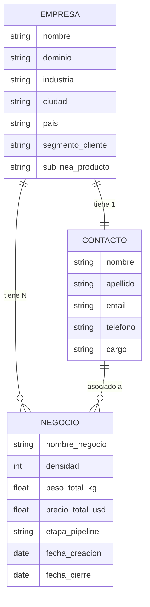
```mermaid
erDiagram
    EMPRESA ||--|| CONTACTO : "tiene 1"
    EMPRESA ||--o{ NEGOCIO : "tiene N"
    CONTACTO ||--o{ NEGOCIO : "asociado a"

    EMPRESA {
        string nombre
        string dominio
        string industria
        string ciudad
        string pais
        string segmento_cliente
        string sublinea_producto
    }
    CONTACTO {
        string nombre
        string apellido
        string email
        string telefono
        string cargo
    }
    NEGOCIO {
        string nombre_negocio
        int densidad
        float peso_total_kg
        float precio_total_usd
        string etapa_pipeline
        date fecha_creacion
        date fecha_cierre
    }
```

**Fijo por Empresa** (no cambia entre sus Negocios): Segmento de cliente, Sub-línea de producto, Vendedor asignado, Fuente del negocio.
**Variable por Negocio:** Densidad, Peso total, Precio total, Etapa del pipeline, Fecha de creación, Fecha de cierre.

**Claves de asociación:** dominio (Empresa↔Negocio) y email (Contacto↔Negocio), usadas para el matching automático en la importación a HubSpot, no como texto suelto.

---

## 6. Decisiones de diseño

### 6.1 Propiedades personalizadas: el límite de 10 por cuenta

Se mantuvo un número acotado de propiedades personalizadas, priorizando las que aportan valor directo de reporte comercial sobre las que son solo capa operativa:

| Propiedad | Objeto | ¿Se incluyó? | Razón |
|---|---|---|---|
| Segmento de cliente | Negocio | ✅ | Necesaria para reportes de ingreso por segmento |
| Sub-línea de producto | Negocio | ✅ | Necesaria para reportes de ingreso por producto |
| Densidad (kg/m³) | Negocio | ✅ | Liga directa a precio/kg, variable clave por pedido |
| Peso total (kg) | Negocio | ✅ | Única forma de reportar en la "capa de negocio interna" |
| Vendedor asignado (ref. interna) | Negocio | ✅ | Practicar reportes de distribución de equipo |
| Fuente del negocio | Negocio | ✅ | Reporte de canal de adquisición |
| Zona de Venta | Negocio | ✅ (denormalizada desde Empresa) | Sin denormalizar no se podía cruzar Zona × Valor en un solo reporte de un objeto |
| Duración del ciclo de venta (días) | Negocio | ✅ | KPI de forecast, calculado en Python (`Fecha de cierre − Fecha de creación`) |
| N.° de planchas / Espesor (cm) | (ninguno) | ❌ Descartadas | Capa operativa/técnica de Producción, sin valor de reporte comercial directo |

[Opcional: captura de la lista completa de las 8 propiedades personalizadas en Negocio, si quieres reforzar con vista de conjunto además de los dos ejemplos de abajo]

**Ejemplos de propiedades creadas:**

*Peso Total (kg), tipo Número, calculado en Python antes de importar:*
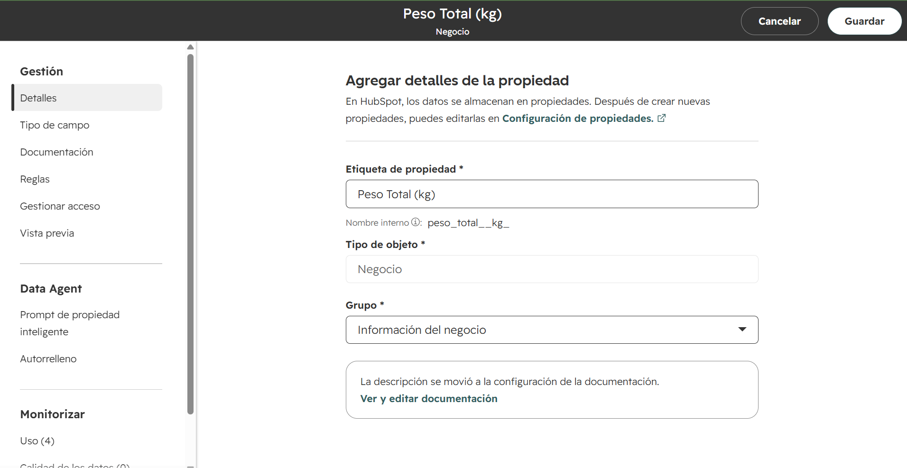

*Vendedor Asignado (referencia interna), lista desplegable con las 10 opciones del roster. Los conteos de "Con valor" por vendedor son consistentes con los totales usados en el Reporte 9 (Ranking de vendedores):*
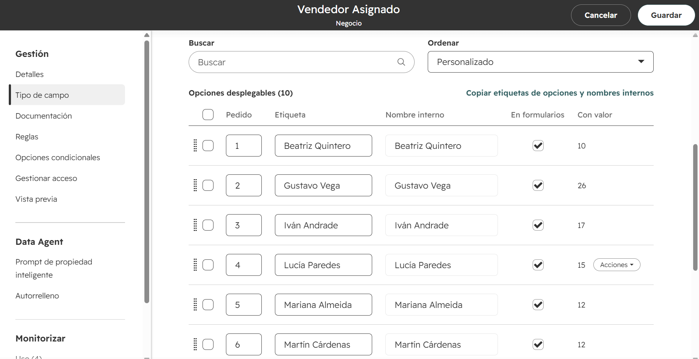

### 6.2 Pipeline

Se **editó el pipeline por defecto** de HubSpot (renombrado "Sales Espumas Cotopaxi") en vez de crear uno nuevo, ya que este proyecto solo necesitaba un pipeline. 6 etapas configuradas: Prospección (10%), Calificación (25%), Cotización Enviada (50%), Negociación (75%), Cerrado-Ganado (100%) y Cerrado-Perdido (0%).

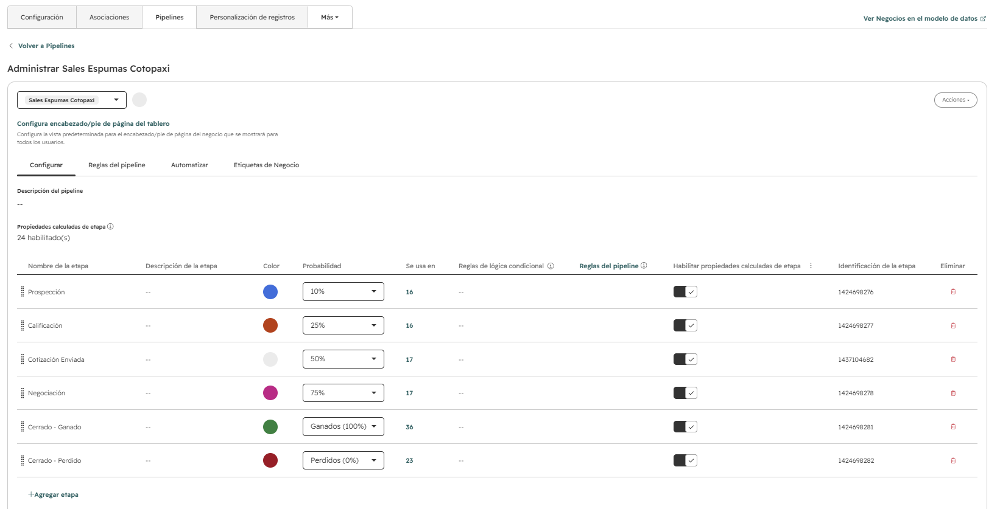

*La columna "Se usa en" muestra la cantidad de Negocios por etapa (16, 16, 17, 17, 36, 23), consistente con la Distribución de negocios por etapa del dashboard (Reporte 3).*

### 6.3 Etapa de ciclo de vida vs. Etapa de pipeline

Se documentó la diferencia conceptual y se decidió **no sincronizar automáticamente** ambas propiedades, ya que requeriría un flujo de trabajo dedicado fuera del alcance de este proyecto. El ciclo de vida mide la relación general del Contacto con la empresa a lo largo del tiempo; la etapa de pipeline mide el estado de una transacción puntual (Negocio).

---

## 7. Errores encontrados y resueltos

*Esta sección es evidencia de troubleshooting real, no de seguir un tutorial paso a paso.*

| # | Error | Causa raíz | Corrección |
|---|---|---|---|
| 1 | Dominio de Empresa mapeado a "URL del sitio web" en vez de "Nombre de dominio de la empresa" | Dos propiedades visualmente similares (`website` vs `domain`); solo `domain` habilita matching automático de duplicados y asociación Contacto↔Empresa | Exportar con Record ID, reimportar en modo actualización mapeando la propiedad correcta |
| 2 | Opción "Importar como: Asociación" no aparecía al importar Contactos | Esa opción solo existe cuando se importan 2 o más objetos simultáneamente, no en importación de un solo objeto | Reimportar seleccionando Contactos y Empresas a la vez |
| 3 | Columna "Etapa del negocio" mapeada a la propiedad "Pipeline" | Confusión entre dos propiedades con nombres parecidos | Remapear a "Etapa del negocio" |
| 4 | HubSpot exigía la propiedad "Pipeline" como obligatoria y el CSV no la tenía | La cuenta ya tenía 2 pipelines, por lo que no se podía asumir el default | Agregar columna `Pipeline` con valor constante en el CSV |
| 5 | Segmento de cliente y Sub-línea se auto-mapearon al objeto Empresa en vez de Negocio | Eran las únicas propiedades con ese nombre en toda la cuenta (nunca se había creado la versión de Negocio) | Crear las propiedades en el objeto Negocio y remapear |
| 6 | "Fecha de cierre" mapeada a una propiedad de Contacto | Mapeo automático incorrecto de objeto | Remapear a "Propiedades de Negocio" |
| 7 | "Precio total (USD)" mapeado a una propiedad de texto personalizada en vez de la nativa "Valor" (`amount`) | La traducción al español de "Amount" no era obvia ("Importe" y "Cantidad" no existían con ese nombre) | Confirmar el nombre real abriendo el formulario nativo "Crear negocio"; remapear a "Valor" |
| 8 | Formato de número regional preseleccionado en "España" (coma decimal) | Los datos del CSV usan punto decimal (formato EE.UU.) | Cambiar el formato de número a "Estados Unidos" antes de finalizar la importación |
| 9 | Densidad creada como lista desplegable ("D30") pero el CSV traía valores numéricos (`30`), 125 errores; "Fuente del negocio" no existía como propiedad, otros 125 errores | Incompatibilidad de tipo de campo con el CSV | Recrear Densidad como tipo Número; crear Fuente del negocio como lista desplegable con las 4 opciones exactas del CSV |

[Completar si aplica: capturas de pantalla del mensaje de error de HubSpot y de la pantalla de mapeo corregido]

---

## 8. Resultados

### 8.1 Dashboard: `Espumas Cotopaxi - Pipeline & Performance` (11 reportes + 4 extensiones)

| # | Reporte | Tipo de gráfico | Pregunta que responde |
|---|---|---|---|
| 1 | Valor del pipeline por etapa | Barras | ¿Dónde está el dinero dentro del embudo? |
| 2 | Ventas por zona | Barras | ¿Qué zona concentra más valor? |
| 3 | Distribución de negocios por etapa | Tabla + Nota | Conteo y % por etapa |
| 4 | Ciclo de venta promedio | KPI | Días promedio de Cerrado-Ganado (52,94 días sobre 36 negocios) |
| 5 | Tasa de cierre (Ganado vs. Perdido) | Circular | 61,02% ganado / 38,98% perdido |
| 6 | Negocios creados por mes | Línea | Tendencia temporal de creación |
| 7 | Ingresos por Sub-línea de producto | Barras | Qué sub-línea genera más ingresos |
| 8 | Ingresos por Segmento de cliente | Barras | Alto: 6.951.631,95 · Mediano: 3.245.957,54 · Bajo: 114.429,65 |
| 9 | Ranking de vendedores | Barras | Performance de equipo comercial (con matices metodológicos, ver sección 9) |
| 10 | Peso total (kg) por zona y densidad | Barras | Única vista en la "capa de negocio interna" (peso, no USD) |
| 11 | Ingresos por Sub-línea × Densidad | Barras apiladas | Desglose de 2 dimensiones (requirió el Generador de informes personalizados) |
| 12 | Vendedor × Zona *(extensión)* | Barras | Confirma que no hay asignación fija de vendedor por zona |
| 13 | Vendedor × Fuente *(extensión)* | Barras | Gustavo Vega lidera Feria Comercial (40%); empate con Beatriz Quintero en Sitio web (26% cada uno) |
| 14 | Peso por densidad, filtrado a Cerrado-Ganado *(extensión)* | Barras | Corrección clave: D25 desplaza a D18 como líder de peso al filtrar solo negocios ganados |
| 15 | Ratio Ganado/Perdido por vendedor *(extensión)* | Barras | Tasa de cierre individual (con la misma advertencia de tamaño de muestra que el Reporte 9) |

**1. Valor del pipeline por etapa**
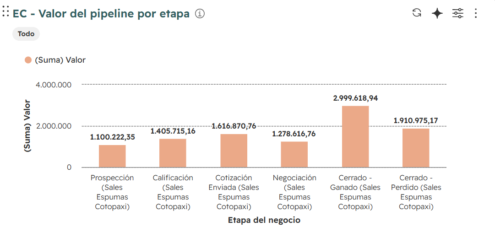

**2. Ventas por zona**
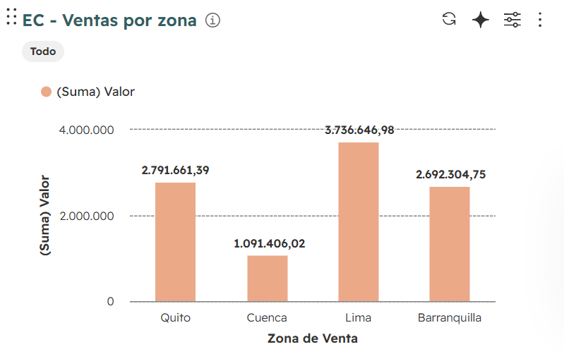

**3. Distribución de negocios por etapa**
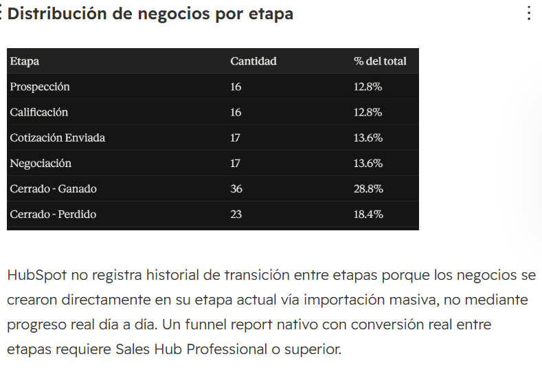

**4. Ciclo de venta promedio**
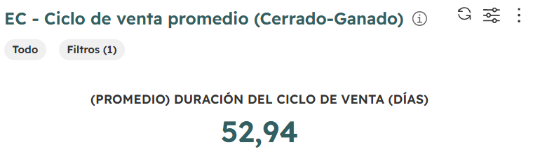

**5. Tasa de cierre (Ganado vs. Perdido)**
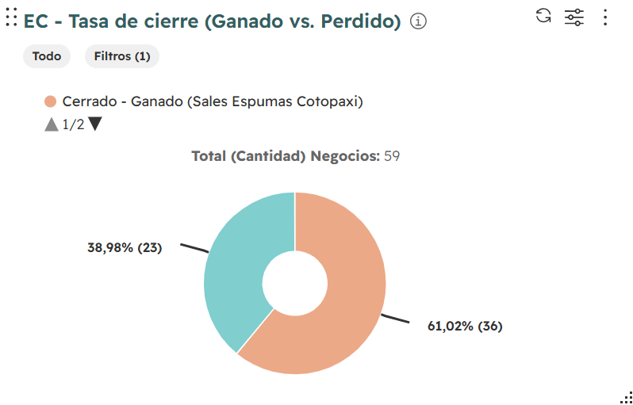

**6. Negocios creados por mes**
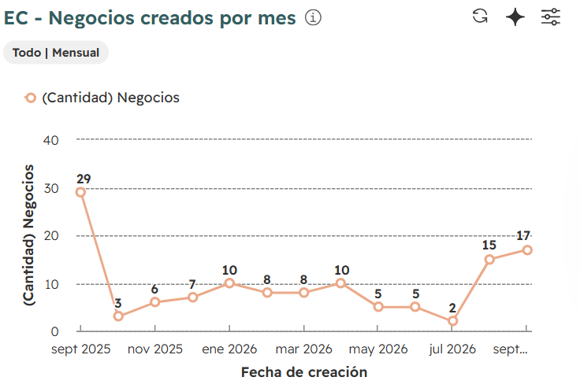

**7. Ingresos por Sub-línea de producto**
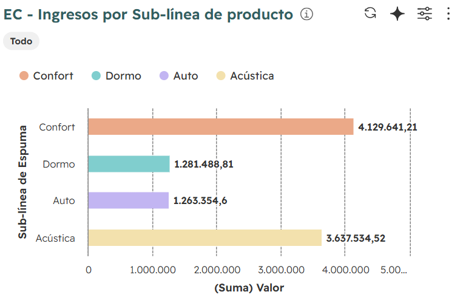

**8. Ingresos por Segmento de cliente**
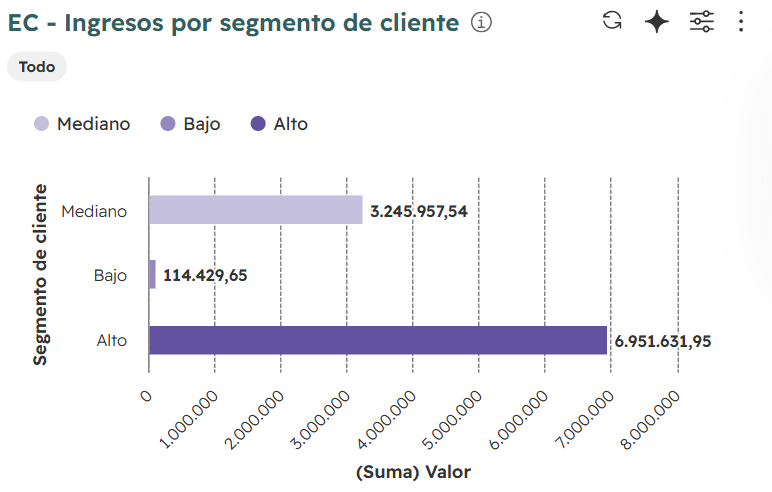

**9. Ranking de vendedores**
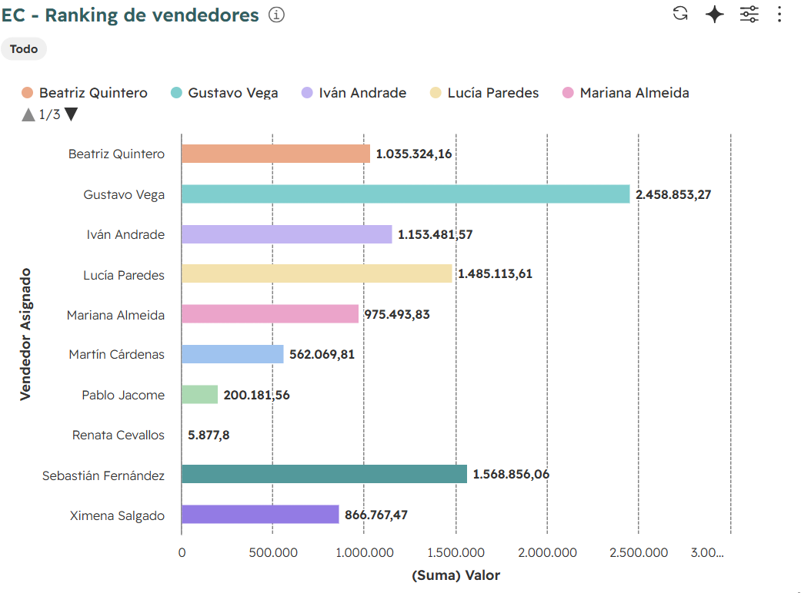

**10. Peso total (kg) por zona y densidad**
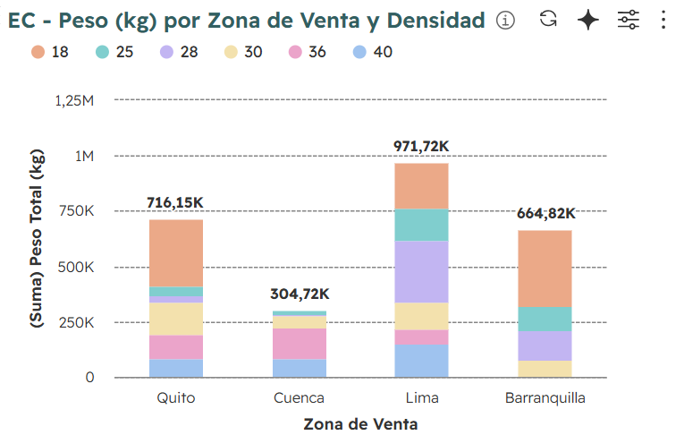

**11. Ingresos por Sub-línea × Densidad**
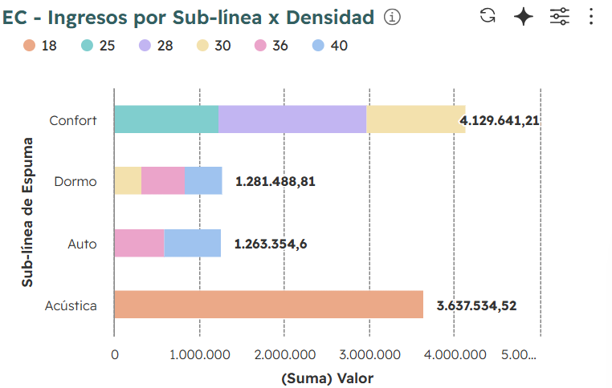

**12. Vendedor × Zona** *(extensión)*
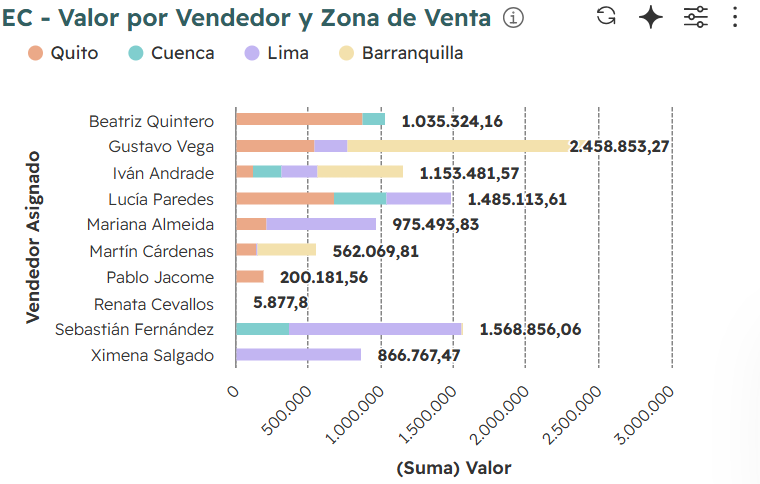

**13. Vendedor × Fuente** *(extensión)*
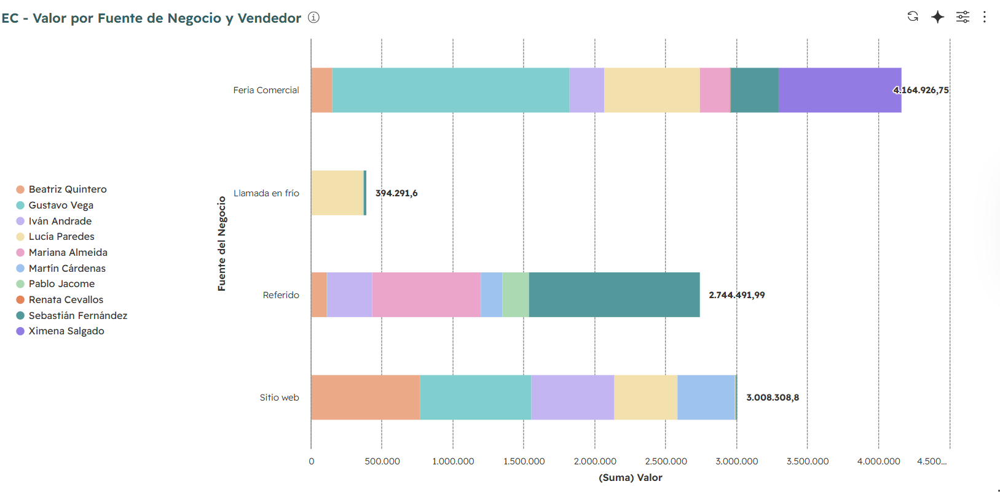

**14. Peso por densidad, filtrado a Cerrado-Ganado** *(extensión)*
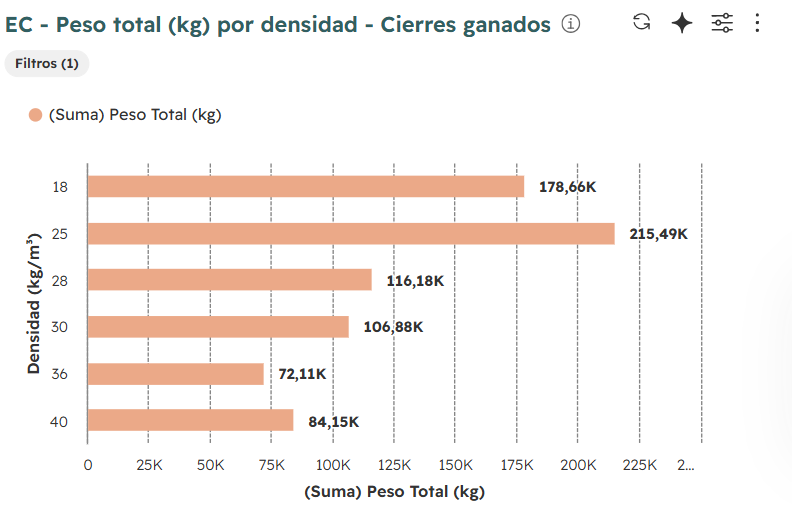

**15. Ratio Ganado/Perdido por vendedor** *(extensión)*
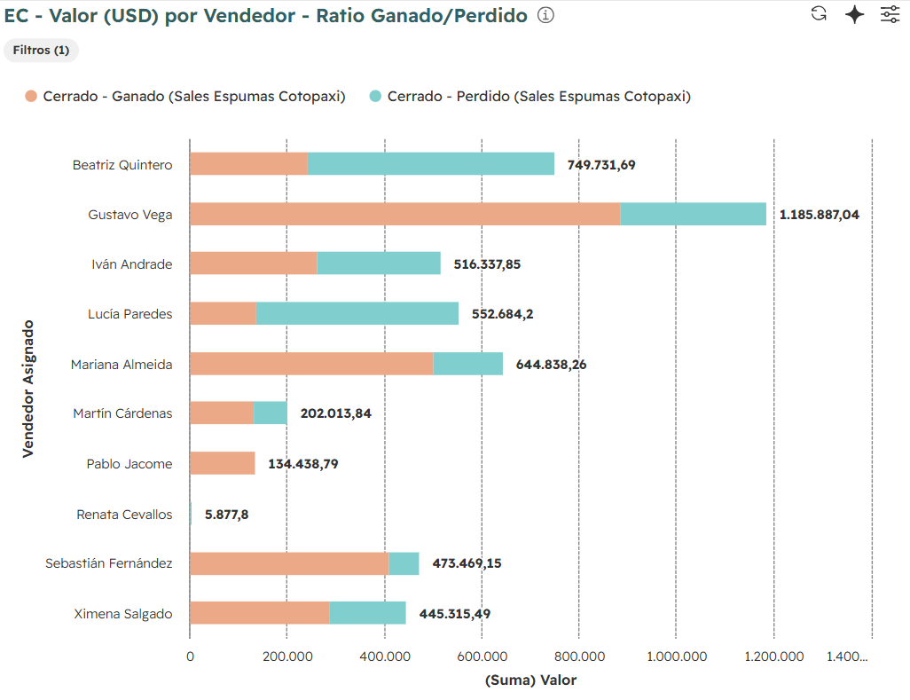

### 8.2 Automatización: Workflow "Cotización 7 días"

Alerta automática (tarea de tipo Llamada, prioridad Alta) cuando un Negocio lleva 7 días calendario sin salir de "Cotización Enviada". Lógica: disparador por condición de etapa, retraso de 7 días, rama if/then, creación de tarea asignada dinámicamente al Propietario del negocio.

**Prueba realizada:** retraso ajustado temporalmente a 2 minutos, negocio movido manualmente a "Cotización Enviada", secuencia completa verificada en el Historial de inscripciones (disparador, retraso, ramificación, tarea creada, workflow terminado, todos en estado "Completado"). Retraso restaurado a 7 días y negocio de prueba devuelto a su etapa original tras la prueba, sin alterar las métricas del dashboard.


**Vista general del workflow**
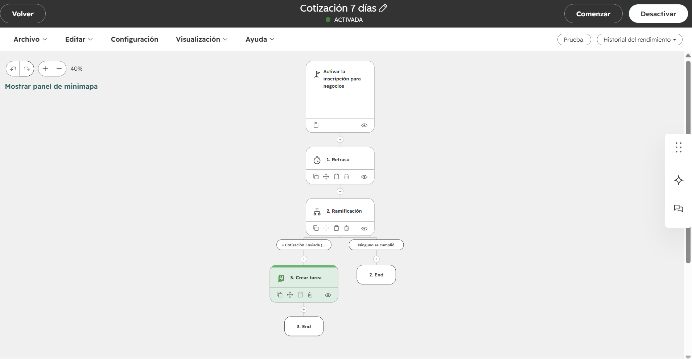

**1. Retraso**
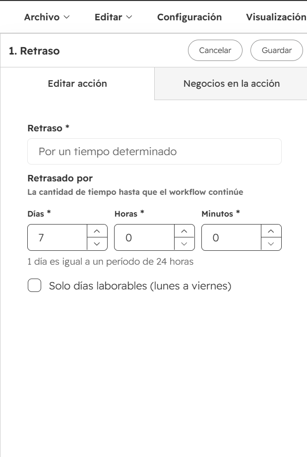

**2. Ramificación**
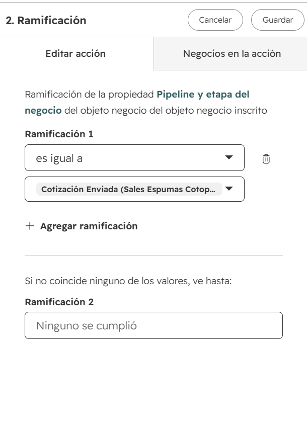

**3. Crear tarea**
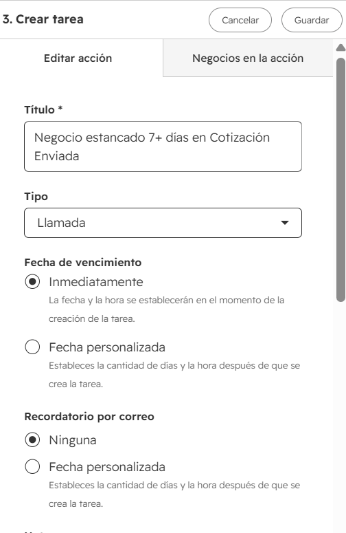
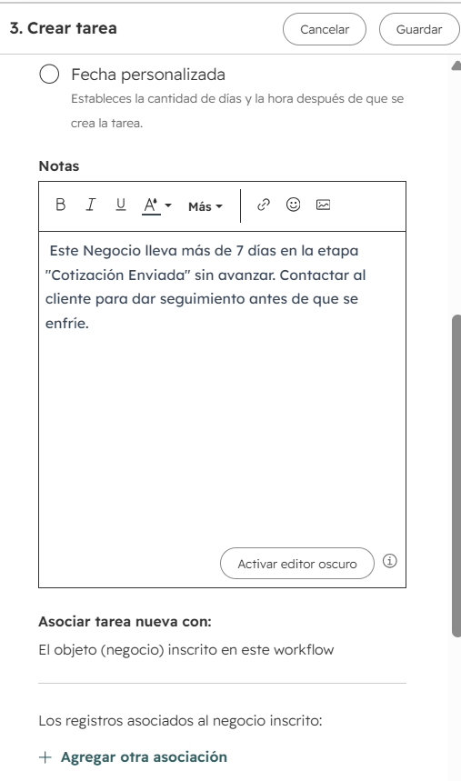
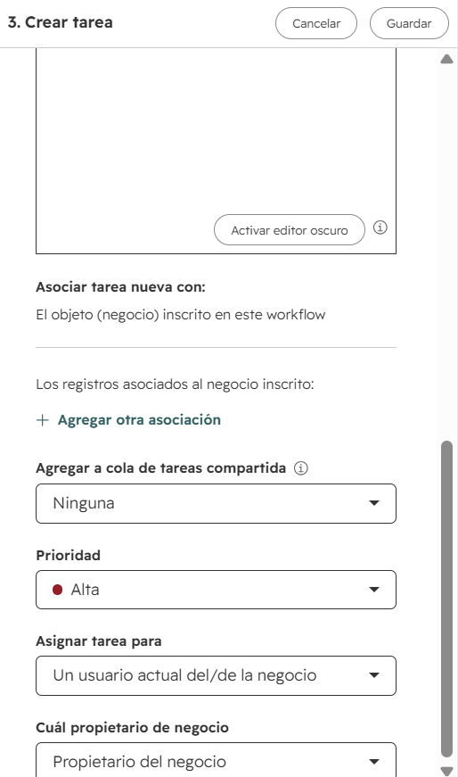

**Historial de inscripciones (prueba exitosa)**
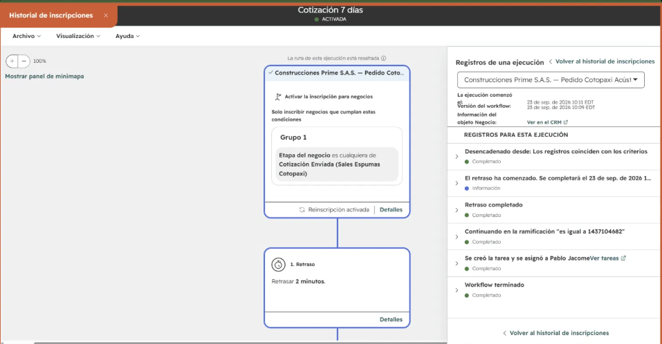

### 8.3 Hallazgos principales del análisis

*Cada hallazgo pasa un filtro simple: ¿cambia una decisión real de negocio, o solo confirma algo que ya sabíamos por diseño? Verificados aritméticamente contra los CSV.*

- **El segmento Bajo genera 60 veces menos valor que el Alto** (114.429 USD vs. 6.951.632 USD), a pesar de representar el 45% de las empresas. Pregunta de negocio directa: ¿se justifica mantener la misma estructura comercial para un segmento que aporta una fracción tan pequeña del ingreso total?
- **Dos sub-líneas concentran la mayoría del ingreso** (Confort y Acústica), mientras Dormo y Auto quedan muy por debajo. Señal para priorizar dónde invertir en producción o en esfuerzo comercial.
- **La prioridad de stock cambia según qué negocios realmente se van a fabricar:** filtrando a Cerrado-Ganado, el grupo de densidades D18+D25+D28+D30 requiere casi 4 veces más material que el grupo D36+D40 (617K kg vs. 156K kg). Información operativa directa para planificación de compra de materia prima.
- **El ranking geográfico es consistente en valor y en peso** (Lima > Quito > Barranquilla > Cuenca), lo que confirma que no es un espejismo causado por mezcla de densidades y respalda con más confianza una decisión de inversión en la zona líder.
- **Ninguna métrica de desempeño individual por vendedor o por fuente es confiable con el tamaño de muestra actual** (3 a 13 negocios por celda). Esto es en sí mismo un hallazgo accionable: advierte contra tomar decisiones de compensación, contratación o inversión en canal basadas en este dashboard tal como está, antes de tener más volumen de datos.

---

## 9. Limitaciones del análisis

*Qué se puede concluir con este dataset y qué no, y por qué. No todo lo que un dashboard puede graficar es una conclusión válida.*

**Con causa verificable en el dataset:**
- Densidad → Precio/kg (relación matemática real, definida en la ficha de negocio).
- Segmento → Rango de peso de compra (validado matemáticamente en las 125 filas).

**Sin mecanismo causal, no presentar como evidencia de desempeño diferencial:**
- Vendedor asignado y Fuente del negocio se asignan de forma aleatoria por diseño del generador sintético, sin correlación con resultado de venta. Con cerca de 49 empresas repartidas entre 10 vendedores y 4 fuentes, cualquier patrón visual (por ejemplo "Vendedor X lidera en Feria Comercial") es indistinguible de ruido de muestra pequeña.
- Los 125 negocios se crearon directamente en su etapa final vía importación masiva, sin historial real de transición entre etapas. Por diseño del dataset, no por límite de ninguna herramienta: ninguna versión de HubSpot podría calcular una tasa de conversión secuencial real (funnel) a partir de datos que nunca se movieron paso a paso.
- El promedio de ciclo de venta (52,94 días) es una cifra global sin desglose por segmento, zona o sub-línea. La ficha de negocio ya anticipa que el ciclo varía por segmento (más corto en Bajo, más largo en Alto por homologación de material).

---

## 10. Qué aprendí y qué haría distinto con datos reales

Este proyecto me llevó a aprender HubSpot y Python aplicado a datos de negocio desde cero. Generé el dataset sintético completo (Empresas, Contactos, Negocios) con Python, resolviendo en código toda la lógica de conversión Plancha → Peso → Precio antes de tocar el CRM.

Importar esos datos me enseñó a diagnosticar errores reales de mapeo (dominio a la propiedad incorrecta, columnas mal dirigidas al objeto equivocado) y a corregirlos sin duplicar registros: exportando los datos ya importados, cruzando por ID de registro único, y reimportando en modo actualización. Aprendí a conectar Empresas, Contactos y Negocios entre sí mediante dominio y email como claves de asociación, a navegar los objetos del CRM, y a crear propiedades personalizadas.

También definí un pipeline de ventas con 6 etapas y probabilidades de cierre, y construí un dashboard de 15 reportes para leer el panorama general del negocio simulado: pipeline por etapa, ventas por zona, desempeño de vendedores, y la relación entre densidad y rentabilidad. Cerré el proyecto con un Flujo de trabajo que monitorea automáticamente los negocios con cotización estancada, para que el equipo comercial no pierda oportunidades por falta de seguimiento.

Si repitiera este proyecto con datos reales de una empresa, dos cosas cambiarían de fondo. La primera: las correlaciones entre vendedor, fuente y zona dejarían de ser ruido a descartar y pasarían a ser algo que hay que validar con estadística real, no asumir ni desechar de entrada como hice aquí con el dataset sintético (donde sabía de antemano que esas variables se asignaron al azar). La segunda: con historial real de transición entre etapas, que este dataset no tiene porque los negocios se crearon directamente en su etapa final vía importación masiva, podría construir el funnel de conversión secuencial real, la pregunta de "dónde se pierden los negocios en el camino" que aquí quedó documentada como limitación, no como respuesta.

---

## Estructura del repositorio

```
espumas-cotopaxi-crm/
├── README.md
├── README.en.md
├── requirements.txt
├── data/
│   ├── empresas_cotopaxi.csv
│   ├── contactos_cotopaxi.csv
│   └── negocios_cotopaxi.csv
├── scripts/
│   └── generar_dataset_cotopaxi_v5.py
├── docs/
│   └── ficha_negocio.md
└── screenshots/
    ├── dashboard/
    ├── workflow/
    └── config/
```

---

